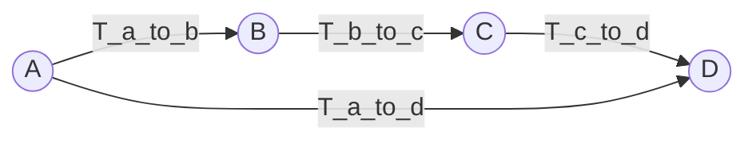

# Coordinate-Systems-Toolbox
Coordinate Systems Toolbox makes your life better in every possible way you can imagine

# Definitions
## Point transformation
To transform a point $p$ from coordinate system $\alpha$ to $\beta$ we use transformation equation 

$$ p_\beta = T^\alpha_\beta p_\alpha,$$

where $p_\alpha$ is a column vector in homogeneous coordinates of the point $p$ in the coordinate system $\alpha$, $T^\alpha_\beta$ is a transformation matrix between coordinate system $\beta$ and $\alpha$. In the code we denote the same transformation T_alpha_to_beta. The transformations are represented in the drawings as an arrow:

## Chain rule
We have coordinate systems A, B, C, and D and corresponding transformations $T^a_b$ (T_a_to_b), $T^b_c$ (T_b_to_c), $T^c_d$ (T_c_to_d). 

To find the transformation directly from coordinate system A to D, which we denote as $T^a_d$ or (T_a_to_d) in code, we can apply the chain rule. Instead of finding a direct transformation from A to D, we can find transformations from A to intermediate systems (B, C) and then from those intermediate systems to D.

This can be mathematically expressed as:

TODO

In code, this would be represented as:

TODO

This chain rule simplifies the process of finding transformations between distant coordinate systems by breaking it down into smaller, manageable steps. It's particularly useful in situations where direct transformations between distant coordinate systems are not readily available or are complex to compute.

# Instalation
pip install git+https://github.com/pheec/Coordinate-Systems-Toolbox.git