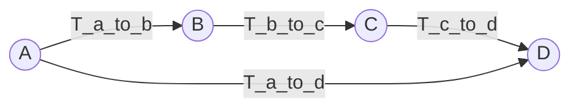

# Coordinate-Systems-Toolbox
Coordinate Systems Toolbox makes your life better in every possible way you can imagine

# Definitions
## Point transformation
To transform a point $p$ from coordinate system $\alpha$ to $\beta$ we use transformation equation 

$$ p_\beta = T^\alpha_\beta p_\alpha,$$

where $p_\alpha$ is a column vector in homogeneous coordinates of the point $p$ in the coordinate system $\alpha$, $T^\alpha_\beta$ is a transformation matrix between coordinate system $\beta$ and $\alpha$. In the code we denote the same transformation T_alpha_to_beta. The transformations are represented in the drawings as an arrow:

## Chain rule

